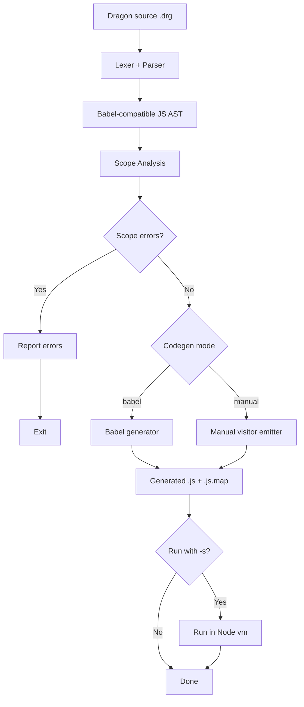

# Dragon to JavaScript Translator

A small compiler lab that translates Dragon language programs to JavaScript.

## Updating your assignment with new code from public template

- [update](docs/template-updates.md)

## Overview

Current pipeline in branch `drg2js`:

1. Lexical analysis with Jison lexer rules (`src/grammar.l`)
2. Parsing with Jison grammar (`src/grammar.jison`) into a Babel-compatible JavaScript AST
3. **Scope analysis** - semantic analysis to validate variable declarations and scope rules
4. JavaScript code generation with Babel generator (or manual generator)
5. Source map emission (`.js.map`) with Dragon source as origin
6. Optional sandbox execution (`-s`) in Node `vm`



## Setup

```bash
npm install
npm run build
```

`npm run build` regenerates `src/parser.cjs` from `src/grammar.jison` and `src/grammar.l`.


## CLI Usage

```bash
bin/drg2js.cjs [options] <filename>
```

Options:

- `-o, --output <fileName>`: output file path for generated JavaScript.
  - Default: `<input>.js`
- `-a, --ast`: write AST JSON to `<output>.ast.json`.
- `-g --codegen <babel|manual>`: select generator backend (default: `babel`).
- `-p --pretty`: format generated JavaScript using Prettier (manual mode).
- `-s, --sandbox`: execute generated JavaScript in sandbox.
- `-v, --verbose`: enable verbose logging.
- `--skip-scope-analysis`: skip scope analysis phase (useful for testing runtime errors).

## Scope Analysis

The compiler performs semantic analysis to validate variable declarations and scope rules. This phase:

- **Detects undeclared variables** - reports when a variable is used without being declared
- **Validates redeclarations** - prevents declaring the same variable twice in the same scope
- **Validates break statements** - ensures `break` only appears inside loops
- **Supports shadowing** - allows inner scopes to redefine outer scope variables
- **Tracks type information** - preserves Dragon type annotations for future type checking phases

### Scope Error Examples

The scope analysis validates several types of scope constraints. Here are examples of each:

#### 1. Undeclared Variable

File: [examples/scope-err01.drg](examples/scope-err01.drg)

`➜  dragon2js git:(C3scope) cat -n examples/`
```C
scope-err01.drg
     1  { a = 0.0; }
```

Error output:

```console
bin/drg2js.cjs examples/scope-err01.drg
```
```
Scope Error: Variable 'a' is not declared
  at examples/scope-err01.drg:1:2
```

#### 2. Variable Not in Scope (Nested Blocks)

File: [examples/scope-err02.drg](examples/scope-err02.drg):

```console
➜  dragon2js git:(C3scope) cat -n examples/scope-err02.drg
```
```C
     1  {
     2    int i; 
     3    float[10][10] a;
     4    { 
     5      int i; int j;
     6      a[i][j] = 0.0;
     7      k = 0; // Error: k is not declared in this scope
     8    }
     9    a[i][j] = 0.0; // Undeclared variable 'j' at line 9
    10  }
```

Output:

```console
$ bin/drg2js.cjs examples/scope-err02.drg -o tmp/scope-err02.js   
```
```console
Scope Error: Variable 'k' is not declared
  at examples/scope-err02.drg:7:4
Scope Error: Variable 'j' is not declared
  at examples/scope-err02.drg:9:7
```

This example demonstrates:
- **Shadowing**: inner block redefines `i` (allowed)
- **Scope isolation**: variables declared in inner block (`j`) are not visible in outer block
- **Multiple errors**: reports all undeclared variable errors

#### 3. Redeclaration in Same Scope

File: `examples/scope-err03.drg`
```C
{
  int i; 
  int i; int j;             // Error: 'i' is already declared in this scope
  i = 0;
}
```

Output:

```console
$ bin/drg2js.cjs examples/scope-err03.drg -o tmp/scope-err03.js
```
```
Scope Error: Variable 'i' is already declared in this scope
  at examples/scope-err03.drg:3:2
```
Attempting to declare the same variable twice in the same block is an error. Note that redeclaring in an *inner* scope is allowed (shadowing).

#### 4. Break Outside Loop

File: [examples/scope-err04.drg](examples/scope-err04.drg)

```C
{  
  break;                    // Error: break must be inside a loop
}
```

The `break` statement is only allowed inside `while` or `do...while` loops:

```console 
➜  dragon2js git:(C3scope) bin/drg2js.cjs examples/scope-err04.drg
Scope Error: Break statement must be inside a loop
  at examples/scope-err04.drg:2:4
```

### Scope Analysis and JavaScript Globals

Since Dragon identifiers are prefixed with `$`, all JavaScript globals (like `console`, `Array`, `Object`, `Math`, etc.) can be safely used by the generated code without triggering scope validation errors. The scope analysis only validates Dragon user variables; JavaScript system identifiers are assumed to exist in the runtime environment.

### Skipping Scope Analysis

For testing purposes, you can skip scope analysis with the `--skip-scope-analysis` flag:

```bash
bin/drg2js.cjs examples/scope-err01.drg --skip-scope-analysis -o tmp/test.js
```

This allows compilation even with scope errors, useful when testing runtime behavior of intentionally invalid code.

## Project Structure

```text
.
|-- __tests__/
|-- bin/
|   |-- drg2js.cjs
|   |-- debug-prepare.cjs
└── src
    ├── ast-builders.cjs
    ├── codegen.cjs
    ├── grammar.jison
    ├── grammar.l
    ├── index.cjs
    ├── io-helpers.cjs
    ├── parser.cjs
    ├── sandbox-helpers.cjs
    └── scope-analysis.cjs
```

## How to 

- See [docs/scope/README.md](docs/scope/README.md)

