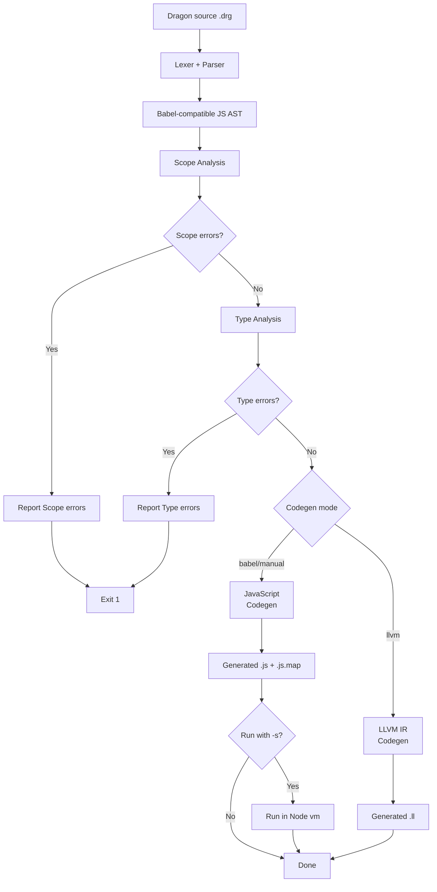

# Dragon Translator (Dragon to JS and LLVM IR)

This project is a small compiler lab for the Dragon language.

It supports two code generation targets:

- JavaScript (`babel` or `manual` codegen modes)
- LLVM IR (`llvm` codegen mode)

Current pipeline in branch `drg2js`:

1. Lexical analysis with Jison lexer rules (`src/grammar.l`)
2. Parsing with Jison grammar (`src/grammar.jison`) into a Babel-compatible JavaScript AST
3. **Scope analysis** - semantic analysis to validate variable declarations and scope rules
4. **Type analysis** - validates operations are performed on compatible types
5. **Code generation** - generates either:
   - **JavaScript** code with Babel generator (or manual generator)
   - **LLVM IR** code for low-level compilation (NEW!)
6. Source map emission (`.js.map`) with Dragon source as origin (JavaScript mode)
7. Optional sandbox execution (`-s`) in Node `vm` (JavaScript mode)



## Quick Start

1. Install dependencies:

```bash
npm install
```

2. Build the parser (required after grammar changes):

```bash
npm run build
```

3. Translate a Dragon program:

```bash
bin/drg2js.cjs examples/simple00.drg
```

By default this generates JavaScript.

## Generate LLVM IR

```bash
bin/drg2js.cjs -g llvm examples/llvm/llvm-0-int.drg -o tmp/llvm-0.ll
```

Execute generated IR with LLVM interpreter:

```bash
lli tmp/llvm-0.ll
```

For a step-by-step guide, see [docs/llvm/README.md](docs/llvm/README.md).

## CLI

```bash
bin/drg2js.cjs [options] <filename>
```

Key options:

- `-g --codegen <babel|manual|llvm>`: backend selection
- `-o --output <fileName>`: output path
- `-a --ast`: emit AST JSON
- `-p --pretty`: prettify manual JS output
- `-s --sandbox`: run generated JavaScript in a sandbox
- `-v --verbose`: verbose logs
- `--skip-scope-analysis`: skip scope/type analysis

Notes:

- In `llvm` mode, `--sandbox` and `--pretty` are ignored.
- Use `bin/drg2js.cjs -h` for the complete up-to-date help text.

## NPM Scripts

- `npm run build`: regenerate parser/lexer from grammar files
- `npm start -- <file.drg> [options]`: run CLI through npm
- `npm test`: run test suite
- `npm run test:llvm`: run LLVM-focused tests
- `npm run test:llvm:simple`: run simple LLVM fixtures
- `npm run test:llvm:array`: run array LLVM fixtures
- `npm run test:llvm:control`: run control-flow LLVM fixtures

## Project Structure

```text
bin/                CLI and debug helper scripts
src/                compiler source code
 ├── ...            lexer, parser, scope analysis, type analysis, JS codegen, etc.
 └── llvm/          LLVM backend internals
      ├── context.cjs     # emitted code, generation of labels, registers, addresses
      ├── emit-helpers.cjs # Low-level code emission: emitStrcpy, emitStrcat, emitMalloc,
      ├── main.cjs        # Visitor functions for LLVM codegen, entry point for LLVM codegen
      ├── node-value.cjs  # Node -> value/register tracking system for LLVM codegen
      ├── string-helpers.cjs
      ├── type-helpers.cjs
      └── visitor-helpers.cjs # Large visitor handlers
__tests__/           Jest tests and fixtures
    ├── char-literals.test.cjs
    ├── codegen.test.cjs
    ├── drg2js.test.cjs
    ├── fixtures
    ├── llvm-fixtures-array     # LLVM codegen tests for array features (couples with     the .drg and .expected)
    ├── llvm-fixtures-control   # LLVM codegen tests for control-flow features
    ├── llvm-fixtures-simple    # LLVM codegen tests for simple expressions and     statements
    ├── llvm.test.cjs           # LLVM codegen tests driver
    ├── node-value.test.cjs     # LLVM tests for the node value/register tracking system 
    ├── runtime-errors.test.cjs
    ├── scope-analysis.test.cjs
    ├── syntax-errors.test.cjs
    ├── test-helpers.js
    ├── type-checking.test.cjs
    └── type-system-asymmetry.test.cjs
examples/            Dragon language input examples
docs/                project documentation
docs/llvm/           LLVM backend notes and tutorial
```

## Tutorial

Translating from Dragon to LLVM IR: [docs/llvm/README.md](/docs/llvm/README.md)

## License

MIT

