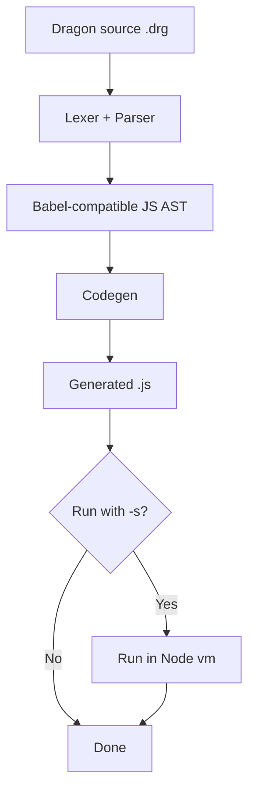

# Dragon to JavaScript Translator

A small compiler lab that translates from Dragon language programs to JavaScript.

## Warning 

> [!CAUTION]
> Some of the documentation files have been written with the assistance of AI tools. If you find any errors, inconsistencies, or areas that need improvement, please feel free to edit the documentation and submit a pull request with your changes. 


## Template Updates for Prácticas Competenciales (Competency Labs)

See instructions for template updates [docs/template-updates.md](docs/template-updates.md)

## Overview

Current pipeline includes:

1. Lexical analysis with Jison lexer rules (`src/grammar.l`)
2. Parsing with Jison grammar (`src/grammar.jison`) into a Babel-compatible JavaScript AST
3. JavaScript code generation with Babel generator 
4. Optional sandbox execution (`-s`) in Node `vm`



## Setup

```bash
npm install
npm run build
```

`npm run build` regenerates `src/parser.cjs` from `src/grammar.jison` and `src/grammar.l`.

## Scripts

- `npm run build`: regenerate parser/lexer.
- `npm start -- <file.drg> [options]`: run translator CLI.
- `npm test`: run Jest tests.
- `npm run coverage`: run tests with coverage report.

## CLI Usage

```bash
bin/drg2js.cjs [options] <filename>
```

Options:

- `-o, --output <fileName>`: output file path for generated JavaScript.
  - Default: `<input>.js`
- `-a, --ast`: write AST JSON to `<output>.ast.json`.
- `-s, --sandbox`: execute generated JavaScript in sandbox.
- `-v, --verbose`: enable verbose logging.

## Basic Examples

Generate JavaScript. Let us compile [examples/prac-comp.drg](examples/prac-comp.drg) to JavaScript:

```bash
bin/drg2js.cjs examples/prac-comp.drg
```

This writes `examples/prac-comp.js` by default.

Generate to an explicit path:

```bash
bin/drg2js.cjs examples/prac-comp.drg -o tmp/prac-comp.js --ast
```

This writes [tmp/prac-comp.js](tmp/prac-comp.js) and [tmp/prac-comp.js.ast.json](tmp/prac-comp.js.ast.json).

Run in sandbox:

```bash
bin/drg2js.cjs examples/bool01.drg -s
```

Expect the output to be:

```
true
```

### Array Initialization Example

Arrays in Dragon are automatically initialized to `0` (this is a lab requirement: arrays must be unitialized to 0'):

Dragon source (`examples/simple02.drg`):
```dragon
{ int[10] arr; }
```

Generated JavaScript:
```bash
bin/drg2js.cjs examples/simple02.drg -o tmp/simple02.js
```

This produces JavaScript with arrays initialized using `Array.from()`:

```javascript
{
  let $arr = Array.from({
    length: 10
  }, () => 0);
}
```

All array elements are initialized to `0` automatically. Therefore, when seen a declaration like `int[10] arr;` **you must build an AST node that declares the variable `$arr` and initializes to `0` all its elements**.

Scalar variables are also initialized:

```C
{ 
  int x;          // Initialized to 0
  float y;        // Initialized to 0
  bool z;         // Initialized to false
  char msg;       // Initialized to ""
}
```

Generated JavaScript:

```javascript
{
  let $x = 0;
  let $y = 0;
  let $z = false;
  let $msg = "";
}
```

**Note that Dragon variable identifiers are prefixed with `$` to avoid collisions with compiler developer identifiers and JavaScript system identifiers**.

## Project Structure

Simplified project structure:

```text
.
|-- bin/
|   `-- drg2js.cjs
|
|-- examples/*.drg   
|
|-- src/
|   |-- grammar.jison
|   |-- grammar.l
|   |-- parser.cjs     // generated by Jison
|   |-- codegen.cjs
|   |-- io-helpers.cjs
|   `-- sandbox-helpers.cjs
|
|-- tmp/*.js. // use it for temporary outputs during development, ignored by git unless you force add files
|
`-- __tests__/
```

### tmp folder

The `tmp` folder is "ignored" by git (`.gitignore`) and we suggest you use it for temporary outputs during development. We leave it here so that you can see some examples we have left of generated JavaScript files and AST json to imitate. 

## How to do it 

- [Grammar](docs/grammar/README.md)
- [Types](docs/grammar/types/types-and-initialization.md)
- [Lexer](docs/lexer/README.md)
- [The driver: drg2js](docs/drg2js/README.md)
- [Sandboxes](docs/sandbox/README.md)
- [Sourcemaps](docs/sourcemap/README.md)
