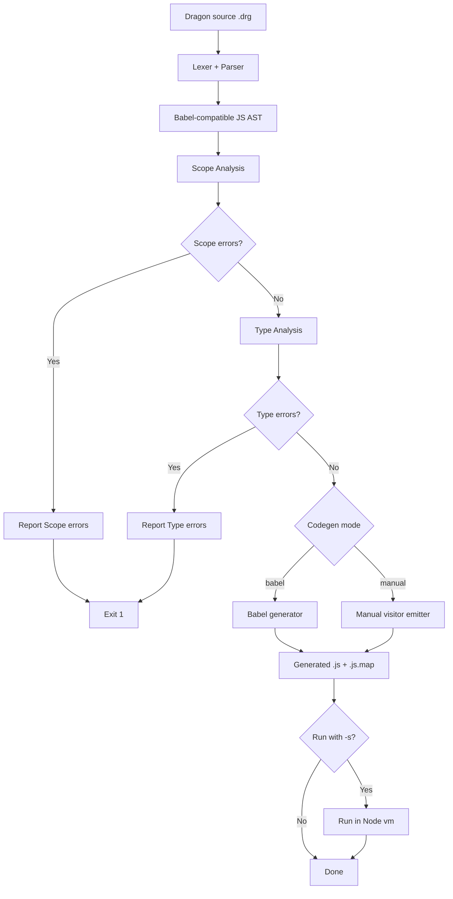

# Dragon to JavaScript Translator

A small compiler lab that translates Dragon language programs to JavaScript. This branch contains the template for the *Type Analysis* phase.

## Updating your assignment

See section [docs/template-updates.md](/docs/template-updates.md)

## Overview

Current pipeline in branch `drg2js`:

1. Lexical analysis with Jison lexer rules (`src/grammar.l`)
2. Parsing with Jison grammar (`src/grammar.jison`) into a Babel-compatible JavaScript AST
3. **Scope analysis** - semantic analysis to validate variable declarations and scope rules
4. **Type analysis** - validates operations are performed on compatible types
5. JavaScript code generation with Babel generator (or manual generator)
6. Source map emission (`.js.map`) with Dragon source as origin
7. Optional sandbox execution (`-s`) in Node `vm`



## Setup

```bash
npm install
npm run build
```

`npm run build` regenerates `src/parser.cjs` from `src/grammar.jison` and `src/grammar.l`.

## Scripts

- `npm run build`: regenerate parser/lexer from grammar files.
- `npm start -- <file.drg> [options]`: run translator CLI (same as `bin/drg2js.cjs`).
- `npm test`: run Jest test suite (all 121 tests across 8 suites).
  - `npm test -- __tests__/type-checking.test.cjs`: run only type analysis tests (43 tests)
  - `npm test -- __tests__/scope-analysis.test.cjs`: run only scope analysis tests (20 tests)
- `npm run coverage`: run tests with coverage report.
- `npm run debug:prepare -- <file.drg>`: generate debuggable output with source maps.

## CLI Usage

```bash
bin/drg2js.cjs [options] <filename>
```

Options:

- `-o, --output <fileName>`: output file path for generated JavaScript.
  - Default: `<input>.js`
- `-a, --ast`: write AST JSON to `<output>.ast.json`.
-  **`-e --expression`: parse a single expression from the command line instead of a file**
- `-g --codegen <babel|manual>`: select generator backend (default: `manual`).
- `-p --pretty`: format generated JavaScript using Prettier (manual mode).
- `-s, --sandbox`: execute generated JavaScript in sandbox.
- `-v, --verbose`: enable verbose logging.
- `--skip-scope-analysis`: skip scope analysis and type analysis phases (useful for testing runtime errors).

Inconsistency Warning: In this branch, the `--codegen` option default is `manual` 

## Type Analysis: A rule-based type system with table-driven promotions

Véase [docs/type-analysis.md](/docs/type-analysis.md) para una explicación detallada del sistema de tipos implementado en esta práctica.

## Project Structure

```text
.
|-- bin/
|   |-- drg2js.cjs               # Main CLI entry point
|   `-- debug-prepare.cjs        # Source map debugger helper
|-- src/
|   |-- grammar.jison            # Parser grammar (Jison)
|   |-- grammar.l                # Lexer rules (Jison)
|   |-- parser.cjs               # Generated parser from grammar (auto-generated)
|   |-- scope-analysis.cjs       # Scope analysis phase
|   |-- type-check.cjs           # Type analysis phase
|   |-- types.cjs                # Type definitions and helpers
|   |-- type-rules.cjs           # Binary operator type rules
|   |-- type-promotions.cjs      # Type coercion and assignment rules
|   |-- codegen.cjs              # JavaScript code generation
|   |-- io-helpers.cjs           # File I/O and error formatting
|   `-- sandbox-helpers.cjs      # Sandbox execution with diagnostics
|-- __tests__/
|   |-- scope-analysis.test.cjs  # Tests for scope analysis
|   |-- type-checking.test.cjs   # Tests for type analysis
|   |-- drg2js.test.cjs          # Tests for end-to-end compilation
|   |-- syntax-errors.test.cjs   # Tests for parse errors
|   |-- runtime-errors.test.cjs  # Tests for runtime behavior
|   `-- fixtures/                # Test fixture Dragon programs
|       |-- scope-err*.drg
|       |-- type-err*.drg
|       `-- *.drg
|-- examples/*.drg                     # Example Dragon programs
|-- docs/
|   |-- types-planning.md        # Type analysis design documentation
|   `-- images/
`-- README.md                    # This file
```

Omitted folders `examples`, `tmp` and  `coverage`

### Key Files for Type Analysis

- **`src/types.cjs`** - Defines type constants (INT, FLOAT, BOOL, CHAR) and helper functions (`isNumeric`, `isScalarNumeric`, `typeToString`, `sameType`)
- **`src/type-check.cjs`** - Main type checking implementation (TypeChecker class with visitor methods)
- **`src/type-rules.cjs`** - Operator type rules (which operands each operator accepts)
- **`src/type-promotions.cjs`** - Type coercion logic and assignment compatibility rules

## References

* [docs/type-analysis.md](/docs/type-analysis.md) 
* [Subtyping and Type Lattices](/docs/subtyping-and-lattices.md)
* [Checking vs Inference](/docs/checking-vs-inference.md) 
* [docs/FUTURE_TARGETS.md](docs/FUTURE_TARGETS.md)
* [docs/TYPE_SYSTEM_DESIGN.md](docs/TYPE_SYSTEM_DESIGN.md)
* [docs/REFERENCES.md](/docs/REFERENCES.md)
* [Type Systems](https://en.wikipedia.org/wiki/Type_system) - Wikipedia
* [Type Checking](https://en.wikipedia.org/wiki/Type_checking) - Wikipedia
* [Type Systems and Programming Languages](https://www.cis.upenn.edu/~bcpierce/tapl/) - Benjamin Pierce. Comprehensive textbook on type systems.
* [docs/sourcemaps.md](docs/sourcemaps.md)
* [How to Implement Source Maps](https://oneuptime.com/blog/post/2026-01-30-source-maps/view). @nawazdhandala. Jan 30, 2026. Blog at OneUpTime.
* [Draft ECMA-426. Source map format specification](https://tc39.es/ecma426/) / March 2, 2026. Ecma International.