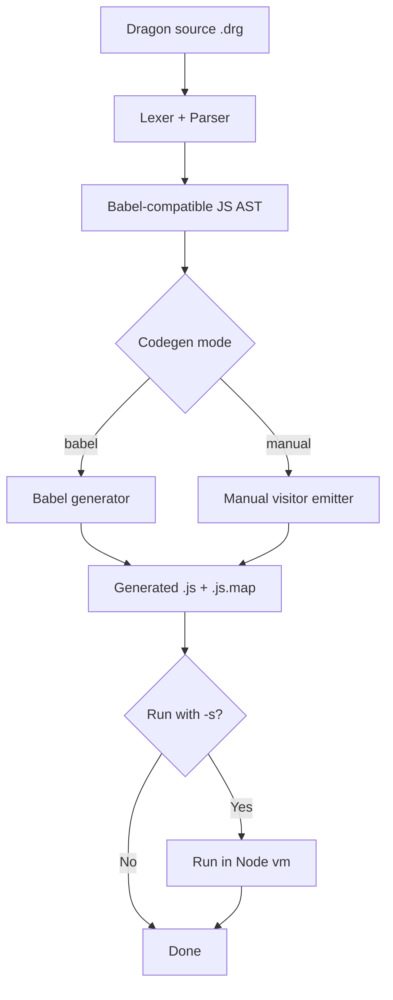
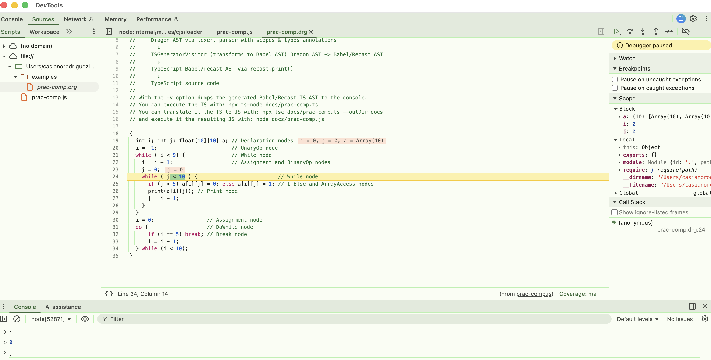
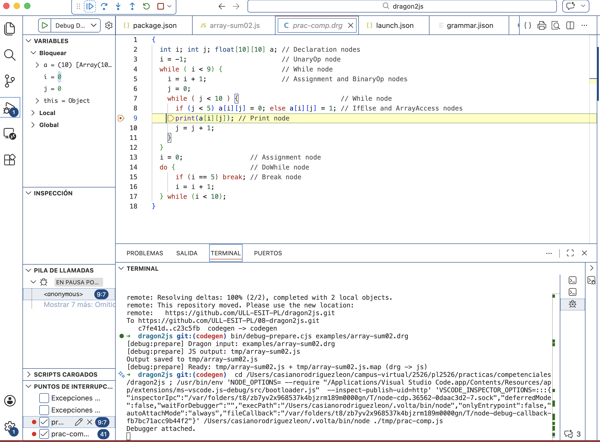

# Dragon to JavaScript Translator

A small compiler lab that translates Dragon language programs to JavaScript. We can swap out the code generation backend to use Babel or a manual visitor emitter. The generated JavaScript includes source maps for debugging and improve runtime error messages with location information referring back to the original Dragon source. 

## Updating your assignment with new code from public template

- [update](docs/template-updates.md)

## Overview

Current pipeline in branch `drg2js`:

1. Lexical analysis with Jison lexer rules (`src/grammar.l`)
2. Parsing with Jison grammar (`src/grammar.jison`) into a Babel-compatible JavaScript AST
3. JavaScript code generation with Babel generator (or manual generator)
4. Source map emission (`.js.map`) with Dragon source as origin
5. Optional sandbox execution (`-s`) in Node `vm` (Where it acts as a source map consumer)



## Setup

```bash
npm install
npm run build
```

`npm run build` regenerates `src/parser.cjs` from `src/grammar.jison` and `src/grammar.l`.

## CLI Usage

```bash
bin/drg2js.cjs [options] <filename>
```

Options:

- `-o, --output <fileName>`: output file path for generated JavaScript.
  - Default: `<input>.js`
- `-a, --ast`: write AST JSON to `<output>.ast.json`.
- `-g --codegen <babel|manual>`: select generator backend (default: `babel`).
- `-s, --sandbox`: execute generated JavaScript in sandbox.
- `-v, --verbose`: enable verbose logging.

## Basic Example

Generate JavaScript:

```bash
bin/drg2js.cjs -g man -v examples/prac-comp.drg -o tmp/src/prac-comp.js
```

This writes [tmp/prac-comp.js](tmp/prac-comp.js) and [tmp/prac-comp.js.map](tmp/prac-comp.js.map) using the `manual` code generator.

## Debug in Chrome and VS Code

Prepare debuggable output:

```bash
npm run debug:prepare -- examples/prac-comp.drg
```

This will write `tmp/prac-comp.js` and `tmp/prac-comp.js.map` with source 
maps pointing to the original `examples/prac-comp.drg` source.
Then launch Node inspector from the `tmp/` folder:

```bash
cd tmp
node --inspect-brk --enable-source-maps prac-comp.js
```

In Chrome, open `chrome://inspect` and click on `inspect` or open Chrome DevTools and attach to the Node target. You should be able to step through the Dragon source via source maps:



Or easier, you can open the generated JavaScript file in VS Code and set breakpoints directly in the Dragon source code (thanks to source maps):



## Runtime Error Mapped To Dragon

You can also debug a runtime failure and see the mapped Dragon location in diagnostics messages. For instance, run [/examples/runtime-err01-loop.drg](/examples/runtime-err01-loop.drg) with `-s`:

```bash
bin/drg2js.cjs examples/runtime-err01-loop.drg -s
```

Expected message format:

```text
Error: Illegal break statement
At source examples/runtime-err01-loop.drg:2:5
At generated code examples/runtime-err01-loop.js:2:1
```

Notice the mapped Dragon source location in the error message. This is implemented in `src/sandbox-helpers.cjs` using `source-map` to remap the generated error stack trace to Dragon source locations.

Here is a second example `bin/drg2js.cjs examples/runtime-err02-arrayaccess.drg -s` that demonstrates a runtime error from an out-of-bounds array access:

```
Error: Cannot read properties of undefined (reading '0')
At source examples/runtime-err02-arrayaccess.drg:6:3
At generated code examples/runtime-err02-arrayaccess.js:4:1
```

and a third example  `bin/drg2js.cjs examples/runtime-err03-arrayassign.drg -s`:

```
Error: Cannot set properties of undefined (setting '0')
At source examples/runtime-err03-arrayassign.drg:6:3
At generated code examples/runtime-err03-arrayassign.js:4:1
```

## Project Structure and What has Changed

```text
├── __tests__
│   ├── codegen.test.cjs.# Tests for code generation. Add to your project
│   ├── drg2js.test.cjs
│   ├── fixtures         # Consolidated examples for testing
│   │   ├── bool01.drg
│   │   ├── ...│
│   │   └── syntax-err01.drg
│   ├── runtime-errors.test.cjs
│   └── syntax-errors.test.cjs
|-- docs/          # Some new documentation files about codegen and scope analysis. 
|-- bin/
|   |-- drg2js.cjs          # Options have changed. Add changes to your project
|   |-- debug-prepare.cjs   # Helper to prepare debuggable output with source maps
├── examples       # Some may have changed
│   ├── bool01.drg
│   ├── input0.drg
│   ├── ...
│   └── type06.drg
`-- src/
     |-- grammar.jison        # Use yours
     |-- grammar.l            # Use yours
     |-- parser.cjs           # Generated by jison from grammar.jison and grammar.l
     |-- codegen.cjs # <-- Most of your work in this lab goes here 
     |-- io-helpers.cjs
     `-- sandbox-helpers.cjs. # Relevant to this lab
```
## How to do it 

- [codegen](docs/codegen/README.md)

## Referencias

### Babel 

- [Babel Parser API](https://babeljs.io/docs/babel-parser)
- [Babel Traverse](https://babeljs.io/docs/babel-traverse) 
- [Babel Plugin Examples](https://github.com/ULL-ESIT-PL/babel-learning/blob/main/src/awesome/README.md).
- [Babel Source Map Options](https://babeljs.io/docs/options#source-map-options)

### Source maps

* Slides in 2024 Web Engines Hackfest: The Future of Source Maps by Jonathan Kuperman (TC39 and Engineer at Bloomberg) 
  * [Slides](https://webengineshackfest.org/2024/slides/the_future_of_source_maps_by_jonathan_kuperman.pdf) 
  * [Video of the talk](https://youtu.be/dre3gPQlYvg?si=GiZynwEtosHqnDgw) 
- Blog [Source maps from top to bottom](https://craigtaub.dev/source-maps-from-top-to-bottom), [Video](https://www.youtube.com/watch?v=nUV4t5V16I4) and [repo craigtaub/our-own-babel-sourcemap)](https://github.com/craigtaub/our-own-babel-sourcemap) by Craig Taub 
- [Source Map Spec](https://tc39.es/ecma426/) ECMA-426 
- Source Map Visualization tool: 
  
  [](https://evanw.github.io/source-map-visualization/)
- Calculadora [BASE64 VLQ CODEC (COder/DECoder) AND SOURCEMAP V3 / ECMA-426 MAPPINGS PARSER](https://www.murzwin.com/base64vlq.html)
- [How to Implement Source Maps](https://oneuptime.com/blog/post/2026-01-30-source-maps) Learn to implement source maps for debugging transpiled code with generation, hosting, and security considerations for production debugging.
- [Source Map MDN](https://developer.mozilla.org/en-US/docs/Glossary/Source_map)
- [Using source maps in DevTools](https://www.youtube.com/embed/SkUcO4ML5U0) Youtube video by Chrome DevTools team
* [Wikipedia: Source-to-source compiler](https://en.wikipedia.org/wiki/Source-to-source_compiler)

### WeakMap

- [WeakMap MDN](https://developer.mozilla.org/en-US/docs/Web/JavaScript/Reference/Global_Objects/WeakMap) 