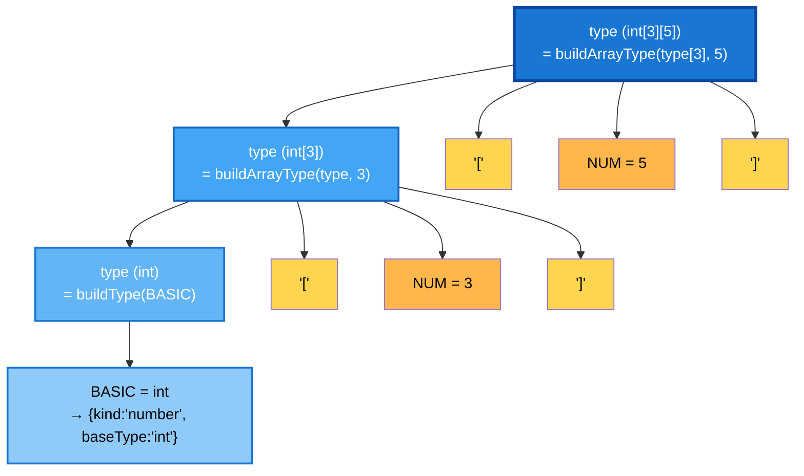

# Types: Basic and Array Types

## typeNode and elementType

See the source file [/examples/initializations.drg](/examples/initializations.drg): 

```C
{
    int[3][2] arr;
    char s;
    bool b;
    int i;
    float f;
} 
```

Run the command: 

```
bin/drg2js.cjs examples/initializations.drg --ast -o tmp/initializations.js
```

This generates [/tmp/initializations.js](/tmp/initializations.js) and [/tmp/initializations.js.ast.json](/tmp/initializations.js.ast.json). The generated JavaScript contains variable declarations with initializers, and the AST includes custom `typeNode` attributes that store the original type information for later use in type checking and code generation.

The code  `bool b;` should be translated to `let $b = false;`. Here follows the corresponding `VariableDeclaration`  node in the AST:

```json
        {
          "type": "VariableDeclaration",
          "kind": "let",
          "typeNode": { // Custom attribute to store type information
            "kind": "boolean",
            "baseType": "bool",
            "loc": { ... }
            }
          },
          "declarations": [
            {
              "type": "VariableDeclarator",
              "id": {
                "type": "Identifier",
                "name": "$b",
                "loc": { ... }
              },
              "init": {
                "type": "BooleanLiteral",
                "value": false
              },
              "loc": { ... }
              }
            }
          ],
          "loc": { ... }
        }
```

In this AST, we have a `VariableDeclaration` node with a custom `typeNode` that describes the variable's type (`bool` in this case). A `typeNode` object has a `kind` property indicating the type (e.g., `"boolean"`), and a `baseType` property storing the original type name. For `int i,` the value of `kind` is `"number"` and its `baseType` is `"int"`. For `char c;` the value of `kind` is `"char"` and its `baseType` is `"char"`.

The `init` field is set to `false`, which is the default value for boolean variables in our Dragon language.

The  `typeNode` attribute is not part of the Babel/ESTree spec, but we use it to store the original type information (like `bool`, `int[5]`, etc.) that our scope analysis can later use for type checking and code generation. **It's perfectly fine to add custom attributes to AST nodes to store additional information your compiler needs. The final code generator ignores `typeNode` and only cares about the `init`, which is already a valid JavaScript value.**

For the array declaration `int[3][2] arr;`, the generated JavaScript is more complex:

```js 
let $arr = Array.from({ length: 2 }, () => Array.from({ length: 3 }, () => 0));
```
This creates a 2D array with 2 rows and 3 columns, where all elements are initialized to `0` (the default value for `int`). Here follows the corresponding `VariableDeclaration` node in the AST:

```json
        {
          "type": "VariableDeclaration",
          "kind": "let",
          "typeNode": { // Custom attribute to store type information
            "kind": "array",
            "elementType": { 
              "kind": "array",
              "elementType": {  // For arrays we store the element type per dimension
                "kind": "number",
                "baseType": "int", 
              },
              "size": 3,
            },
            "size": 2,
          }, // End of typeNode
          "declarations": [
            {
              "type": "VariableDeclarator",
              "id": {
                "type": "Identifier",
                "name": "$arr", // arr is renamed to $arr 
              },
              "init": {
                "type": "CallExpression",
                "callee": {
                  "type": "MemberExpression",
                  "object": {
                    "type": "Identifier",
                    "name": "Array",
                  },
                  "property": {
                    "type": "Identifier",
                    "name": "from",
                  },
                  "computed": false,
                  "optional": null
                },
                "arguments": [
                  {
                    "type": "ObjectExpression",
                    "properties": [
                      {
                        "type": "ObjectProperty",
                        "key": {
                          "type": "Identifier",
                          "name": "length"
                        },
                        "value": {
                          "type": "NumericLiteral",
                          "value": 2
                        },
                        "computed": false,
                        "shorthand": false,
                        "decorators": null
                      }
                    ]
                  },
                  {
                    "type": "ArrowFunctionExpression",
                    "params": [],
                    "body": {
                      "type": "CallExpression",
                      "callee": {
                        "type": "MemberExpression",
                        "object": {
                          "type": "Identifier",
                          "name": "Array",
                        },
                        "property": {
                          "type": "Identifier",
                          "name": "from",
                        },
                        "computed": false,
                        "optional": null
                      },
                      "arguments": [
                        {
                          "type": "ObjectExpression",
                          "properties": [
                            {
                              "type": "ObjectProperty",
                              "key": {
                                "type": "Identifier",
                                "name": "length"
                              },
                              "value": {
                                "type": "NumericLiteral",
                                "value": 3
                              },
                              "computed": false,
                              "shorthand": false,
                              "decorators": null
                            }
                          ]
                        },
                        {
                          "type": "ArrowFunctionExpression",
                          "params": [],
                          "body": {
                            "type": "NumericLiteral",
                            "value": 0
                          },
                          "async": false,
                          "expression": true
                        }
                      ]
                    },
                    "async": false,
                    "expression": true
                  }
                ]
              },
            }
          ],
        }
```
The rule for `type` in the grammar is responsible for building the `typeNode` objects that store the type information. The `buildDecl()` function uses this `typeNode` to generate the appropriate initializer for each variable based on its type:

```jison
type : BASIC
         { $$ = buildType(buildBasicType($1), @$); }
     | type '[' NUM ']'
         { $$ = buildArrayType($1, parseInt($3), @$); }
     ;
```

### Parse Tree de `int [3][5]`

La regla es **left-recursive** (`type '[' NUM ']'` tiene `type` a la izquierda), construyéndose de adentro hacia afuera:

```
Paso 1: BASIC → int
        { kind: 'number', baseType: 'int' }

Paso 2: type '[' NUM ']' con NUM=3
        { kind: 'array', elementType: { kind: 'number', baseType: 'int' }, size: 3 }

Paso 3: type '[' NUM ']' con NUM=5
        { kind: 'array', 
          elementType: { kind: 'array', 
                         elementType: { kind: 'number', baseType: 'int' }, 
                         size: 3 }, 
          size: 5 }
```

Visualmente, el árbol de análisis es:



---

- `buildType()` creates a simple type node for basic types like `int`, `float`, `bool`, and `char`.
 
    ```js
    function buildType(typeNode, loc) {
        return withLoc(typeNode, loc);
    }
- `buildBasicType()` maps the basic type keywords to our internal type representation (e.g., `int` → `{ kind: 'number', baseType: 'int' }`).
    
    ```js
    function buildBasicType(basicTypeName) {
        if (basicTypeName === 'int') return { kind: 'number', baseType: 'int' };
        if (basicTypeName === 'bool') return { kind: 'boolean', baseType: 'bool' };
        if (basicTypeName === 'real' || basicTypeName === 'float') return { kind: 'number', baseType: 'float' };
        if (basicTypeName === 'char') return { kind: 'char', baseType: 'char' };
        return { kind: 'unknown', baseType: 'unknown' };
    }
    ```
- `buildArrayType()` creates a nested type node for array types, storing the element type and size for each dimension.

    ```js
    function buildArrayType(elementType, size, loc) {
        return withLoc({ kind: 'array', elementType: elementType, size: size }, loc);
    }
    ```

### The `BASIC` token 

One of `int`, `float`, `char`, `bool`. `"char"` 
- Creates type object: `{ kind: 'number', baseType: 'int' }`
    
    **kind** will be one of `"number"`, `"boolean"`, or `"char"`

### Array types 

Handle multi-dimensional arrays

- `int [5]` → array of 5 ints
- `int [3][5]` → array of 3, each containing array of 5 ints
- Builds nested type object: `{ kind: 'array', elementType: {...}, size: 5 }`

### typeNode objects examples

```javascript
// int
{ kind: 'number', baseType: 'int' }

// int[5]
{ kind: 'array', elementType: { kind: 'number', baseType: 'int' }, size: 5 }

// int[3][5]
{ kind: 'array', 
  elementType: { kind: 'array', 
                 elementType: { kind: 'number', baseType: 'int' }, 
                 size: 5 }, 
  size: 3 }
```

## Variable Initialization Strategy

Dragon **automatically initializes** all declared variables at declaration time. The initialization value depends on the variable's type—there is no concept of "uninitialized" variables.

### The `buildDecl` Function

The `buildDecl()` function (will be moved to  `src/ast-builders.cjs`) creates a `VariableDeclaration` AST node for each variable:

```javascript
function buildDecl(typeNode, name, loc) {
  const typeInfo = extractTypeInfo(typeNode);  // Extract base type & dimensions
  const id = buildIdentifier(name, loc);       // Create identifier with $ prefix
  const init = generateArrayInit(typeInfo.dimensions, typeInfo.basicType);  // Auto-init
  
  return withLoc({
    type: 'VariableDeclaration',
    kind: 'let',
    typeNode: typeNode,  // Store original type info for scope analysis
    declarations: [withLoc({ 
      type: 'VariableDeclarator', 
      id: id, 
      init: init          // The auto-initialized value
    }, loc)]
  }, loc);
}
```

**What it does**:
1. **Extracts type information**: Splits the type into basic type (`int`, `bool`, etc.) and array dimensions
2. **Creates identifier**: Prefixes variable name with `$` to avoid JavaScript keyword conflicts
3. **Generates initializer**: Calls `generateArrayInit()` to create the appropriate default value
4. **Builds AST node**: Creates a Babel `VariableDeclaration` with an initializer expression

### The `generateArrayInit` Function

For **scalar variables**, initialization is straightforward—just use the default value. But for **arrays**, Dragon generates a complex initialization expression using `Array.from()` recursively:

```javascript
function generateArrayInit(dimensions, basicTypeNode) {
  const defaultValue = getDefaultValue(basicTypeNode);
  
  // Scalar: no dimensions → return default value directly
  if (dimensions.length === 0) {
    return defaultValue;
  }
  
  let init = defaultValue;
  
  // Build from innermost to outermost dimension
  for (let i = dimensions.length - 1; i >= 0; i--) {
    const size = dimensions[i];
    init = {
      type: 'CallExpression',
      callee: {
        type: 'MemberExpression',
        object: { type: 'Identifier', name: 'Array' },
        property: { type: 'Identifier', name: 'from' }
      },
      arguments: [
        {
          type: 'ObjectExpression',
          properties: [{
            type: 'ObjectProperty',
            key: { type: 'Identifier', name: 'length' },
            value: { type: 'NumericLiteral', value: size }
          }]
        },
        {
          type: 'ArrowFunctionExpression',
          params: [],
          body: init,
          expression: true
        }
      ]
    };
  }
  
  return init;
}
```

**How it works**:

The function builds **nested `Array.from()` calls**, one for each dimension, from innermost to outermost.

**Example: `int[3][5]`**

The algorithm processes dimensions `[3, 5]` in reverse order (5 first, then 3):

```javascript
// Start with defaultValue for int: 0
init = { type: 'NumericLiteral', value: 0 }

// Iteration 1: Add dimension [5]
init = Array.from({ length: 5 }, () => 0)

// Iteration 2: Add dimension [3]
init = Array.from({ length: 3 }, () => Array.from({ length: 5 }, () => 0))
```

**Generated JavaScript**:
```javascript
let $arr = Array.from({ length: 3 }, () => Array.from({ length: 5 }, () => 0));
```

This creates:
```javascript
[
  [0, 0, 0, 0, 0],
  [0, 0, 0, 0, 0],
  [0, 0, 0, 0, 0]
]
```

### Type-Based Default Values

The `getDefaultValue()` helper determines the initial value based on the **basic type**:

| Type | Default Value | JavaScript |
|------|---------------|------------|
| `int` | 0 | `0` |
| `float` | 0 | `0` (promoted to float in ops) |
| `bool` | false | `false` |
| `char` | empty string | `""` |

```javascript
function getDefaultValue(basicTypeNode) {
  if (basicTypeNode.kind === 'number') {
    return { type: 'NumericLiteral', value: 0 };
  } else if (basicTypeNode.kind === 'boolean') {
    return { type: 'BooleanLiteral', value: false };
  } else if (basicTypeNode.kind === 'char') {
    return { type: 'StringLiteral', value: '' };
  }
  return { type: 'NumericLiteral', value: 0 };  // Default fallback
}
```


## Navigation: [↑ Up](../grammar-rules.md) | [↑ Top](../README.md)
